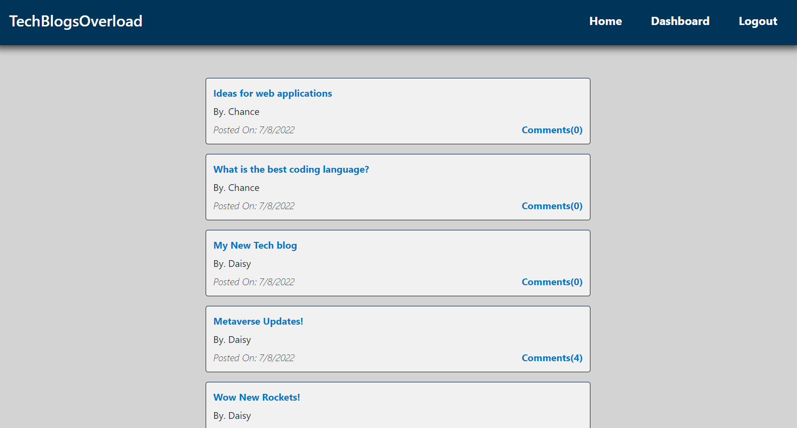

# TechBlogsOverload

## Description
A full-stack web application that hosts technology-related blog posts. Come sign up or sign in and post about your favorite new tech company, news, opinions, and anything else your heart desires! 

## How To Run Application
1. Git clone the repository
2. Install all dependencies with npm install
3. run npm start
4. visit http://localhost:3001 in browser

## Features
Backend database with hashed user passwords and built-in security. A user can login/create an account, make posts, edit posts, delete posts, and comment on other's posts.

## Made With
HTML, CSS, Bootstrap, JavaScript, Node.js, Express.js, Handlebars.js, Sequelize, MySQL, bcrypt, dotenv, Express-session, Connect-session-sequelize

## Demo Link
https://immense-coast-31920.herokuapp.com/
